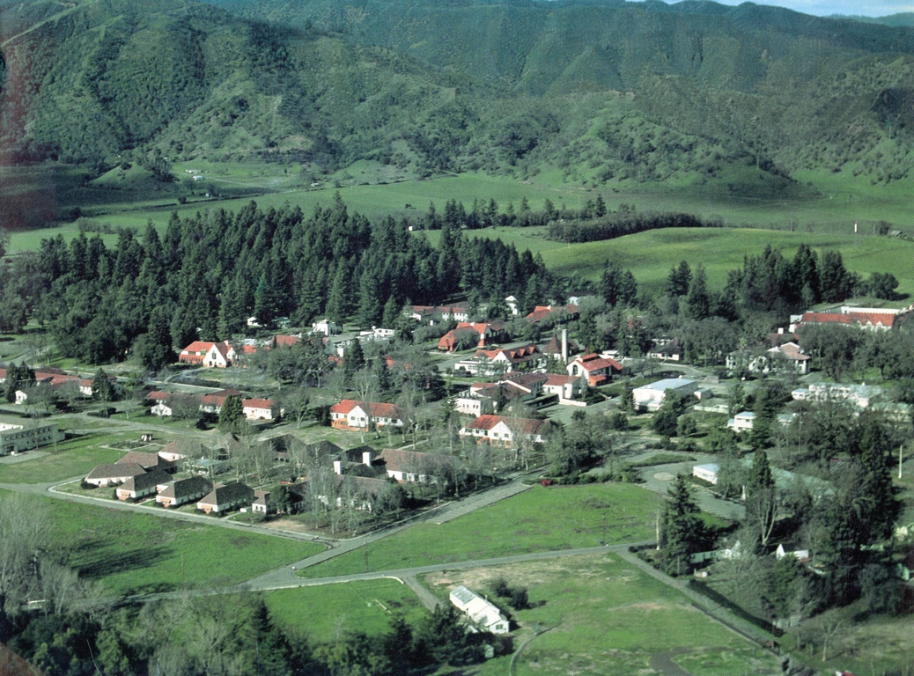
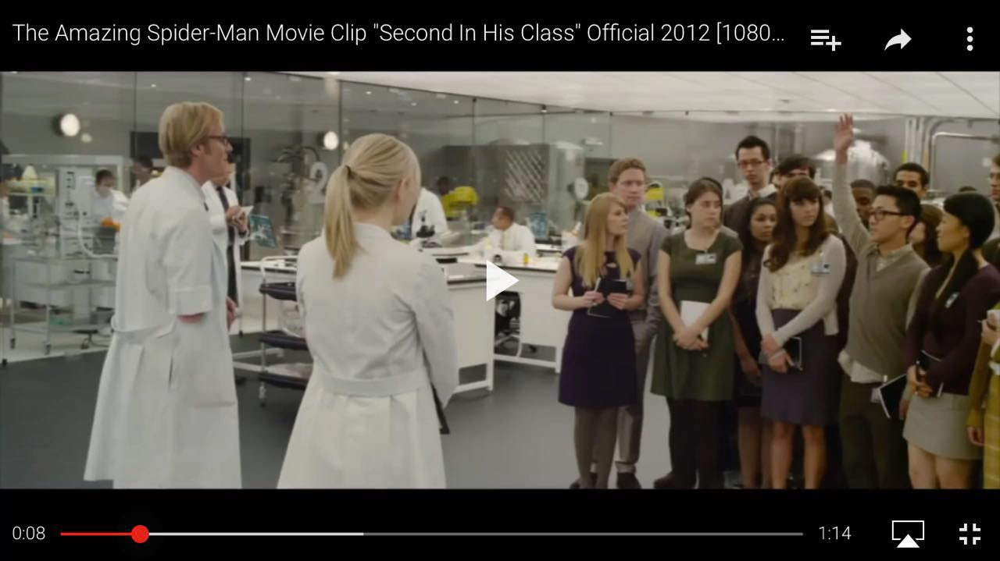
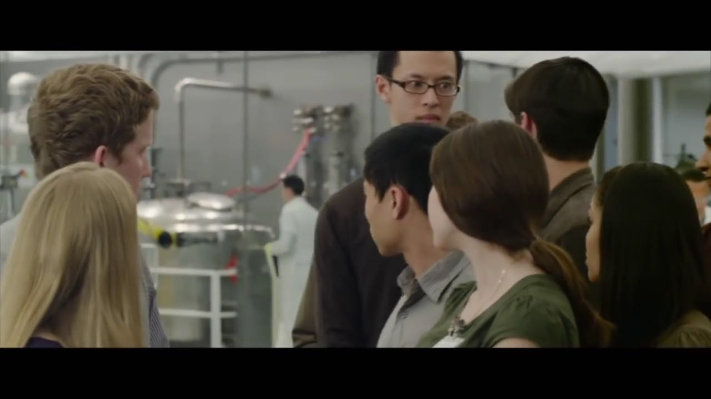
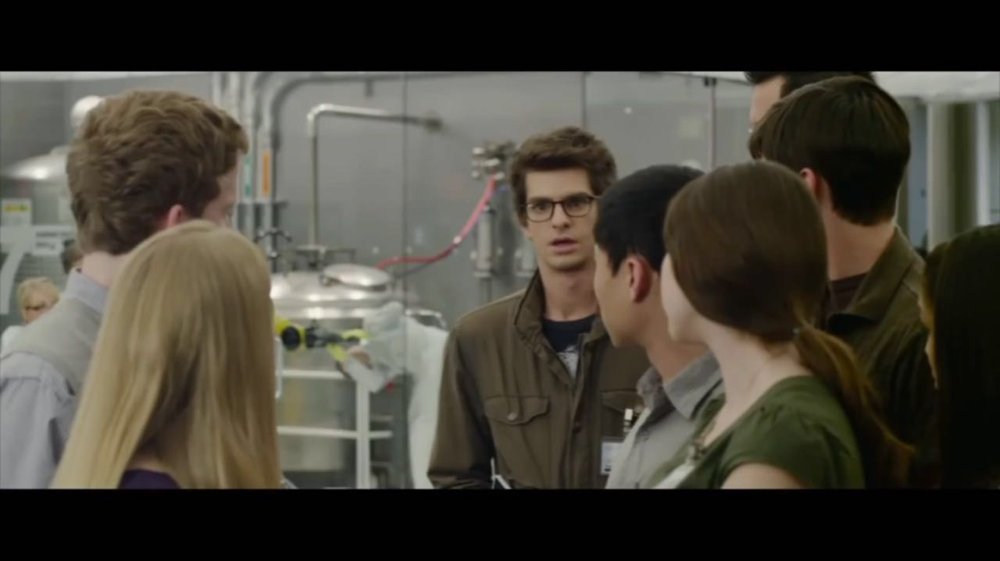
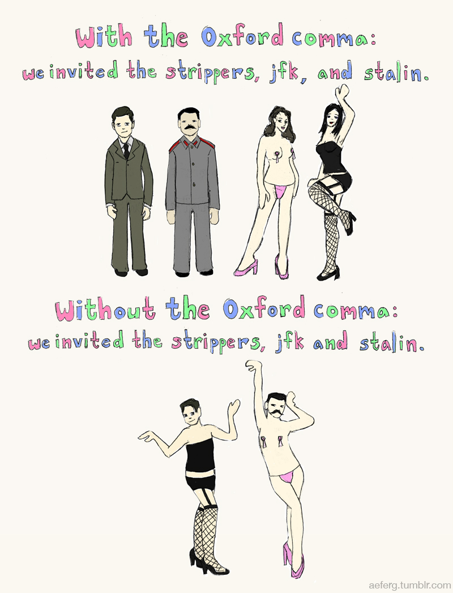

From studying economics in college, I learned how burgeoning economies develop, and how prosperous countries stayed dominant. I left college (as with many other naive students) with a smug ambition of aiding the world’s transition to prosperity, modeled after the grand United States of America. From a simplistic economic standpoint, it was apparent that developing countries needed to be industrialized, and industrialized countries needed to ease into service industries, generating higher and higher levels of GDP, until finally we attain that elusive World Peace.

However, after moving to China, I discovered there were things just as important as wealth creation. China not only allowed me to glimpse into how brutal wealth creation can be, but also gave me an outsider’s perspective of the US and its deteriorating place around the world. For the first time, the US didn’t seem so invincible anymore, and problems everywhere didn't appear so simple.

With my increasing involvement in education however, I realized that most (if not all) social issues - whether mismanaged resources, inefficient infrastructures, or lack of skilled labor – stems from proper education (or lack thereof). A strong education foundation can sow the seeds of civility and concord, and produce an even bigger pie for all of us, as long as we’re willing to share it. Everyone has something to gain from education, and this is why I teach.

I am a problem solver by nature, with a tendency to pick at inefficiencies. I believe poor education is never the fault of the student—it is the teachers’ (or the system that enables/disables the teachers). My staunch belief is that there are much fewer bad students and more incompetent teachers than what we are led to believe.

From my own experience teaching, I’ve discovered that the best students were oftentimes the most notorious, but only because there were no teachers who minded their unorthodox counter-culture ideas, who pushed their idle minds, or who paid attention to the type of learning methods they were most suited for. Attention, guidance, and encouragement—these are all critical ingredients comprising a real educator that school systems need—educators that currently number in few too many, at least based on current archaic, inefficient teaching models.

I am brought to DBC with a single-minded passion to make a difference in education, anywhere in the world where it may take me. There is a dearth of talent in education which I suspect has to do with the ostensibly lack of profit to be made, but I don’t believe that has to be the case. There are __[initiatives being taken by Mark Zuckerberg](http://www.theverge.com/2015/9/3/9252845/facebook-education-software-plp-summit)__ and Google to invest in scalable education models combining both online and offline elements. This means scaling knowledge through online platforms where possible, while providing teachers on-site to provide attention and guidance. It’s an ambitious project, but I believe it has plenty of potential to make a difference, and I’m determined to be a part of it.

I'm currently in China, where I've been for over 4 years. I am co-founder of an __[education company](http://www.cunshande.com)__ helping students prepare and apply for college abroad, but now we're ready for more.

####Now, some fun facts about me:
* I once lived in a buddhist monastry for 3 months during high school. It's based in Ukiah, and it's called "City of Ten Thousand Buddhas"

  
     _Yeah..there was no running from this place_
     _Source-http://www.drba.org/gallery.html_

* I speak a rather obscure dialect of Chinese (Minnan) that is more commonly spoken in Taiwan.
* Although my heritage is Chinese, my parents were born and raised in Vietnam. I also grew up in the Tenderloin, where there is a sizeable Vietnamese population, so I grew up eating Vietnamese food. It's still one of my favorite cuisines.
* I was on the set of Amazing Spiderman (the one with Andrew Garfield). Random series of events led to me being chosen for a background role, and I was flown to New York (from LA) for a few days. If you pay attention to the lab scene right before Peter Parker gets bitten, you'll see me!

  

  

  
     _If only they handed out Academy Awards for facial expressions_

* My greatest petpeeve: Missing oxford comma

  

And there you have it! You're more than welcome to say hi and pester me with awesome (or terrible) questions if you have any.